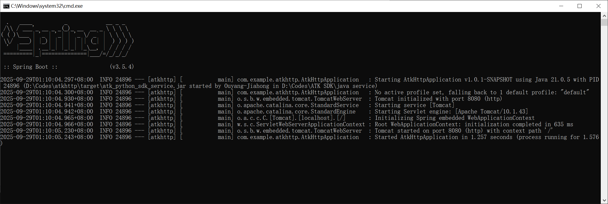
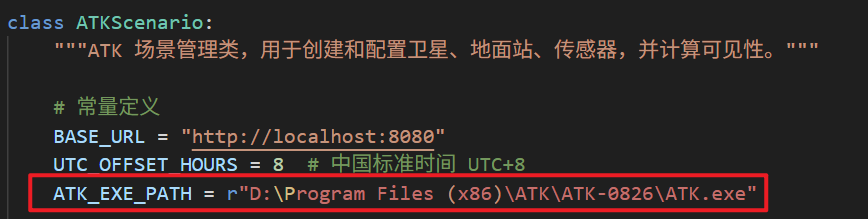
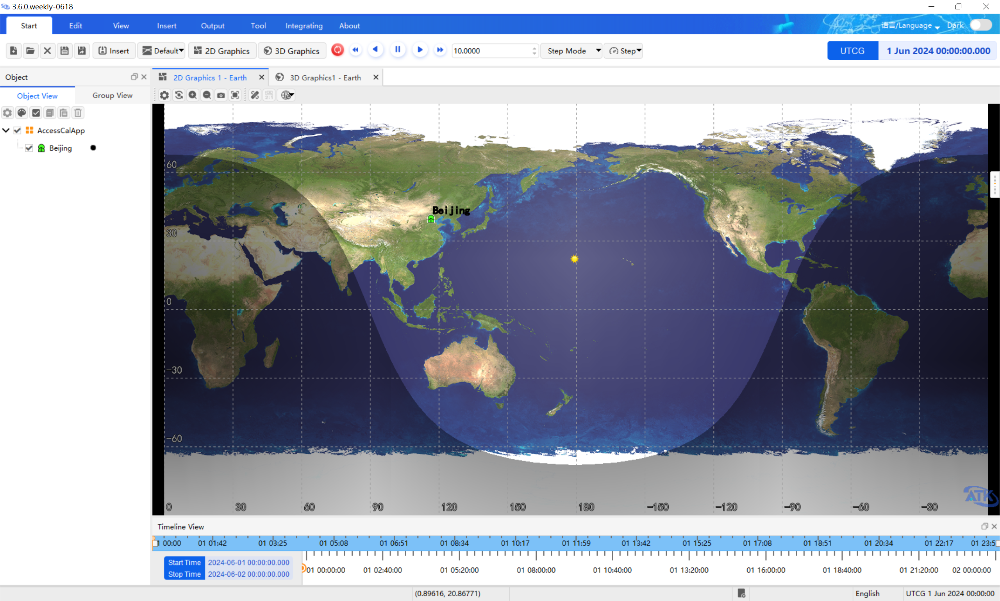
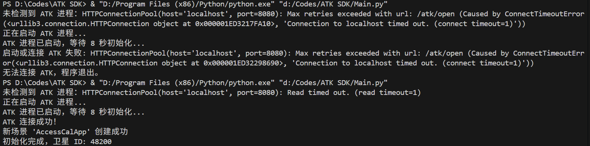

# 引言

在近期的一次卫星轨道机动仿真任务中，我需要为多颗卫星配置轨道机动参数。手动逐一设置过程繁琐且效率低下。为此，我将此前编写的二次开发代码进行了重构，整理出一个通用的 ATK 二次开发类。在开发过程中，我结合使用了自行编写的 Java 二次开发服务与 Python 二次开发包。

在运行本演示程序前，请完成以下准备工作：

1. **安装并注册 ATK**  
   请确保已正确安装并激活 ATK。具体操作可参考我制作的视频教程：  
   【ATK 安装及注册教程】 https://www.bilibili.com/video/BV1tKeazMENG/?share_source=copy_web&vd_source=bdc7e9e76a85f0e5e181fcb11ea574cb

2. **配置 Java 环境**  
   安装 Java 21 SDK，并根据你的系统环境修改 `java service` 文件夹下的 `start.bat` 文件。

3. **启动 Java 二次开发服务**  
   运行 `start.bat` 启动 Java 服务。启动成功后的界面如下所示：  
   

4. **安装 Python 环境**  
   请安装合适的 Python 版本（建议自行测试兼容性）。  
   我在开发时使用的是 Python 3.13.5。

5. **配置 ATK 路径**  
   在 `funcs.py` 文件中，设置你本地 `ATK.exe` 的完整路径：  
   

6. **运行主程序**  
   执行 `Main.py`，程序运行后将自动调用 ATK。以下是 ATK 软件界面及控制台输出的截图：  
     
   

# 注意事项

如有任何疑问，欢迎通过邮箱联系我：ouyangjiahong22@nudt.edu.cn